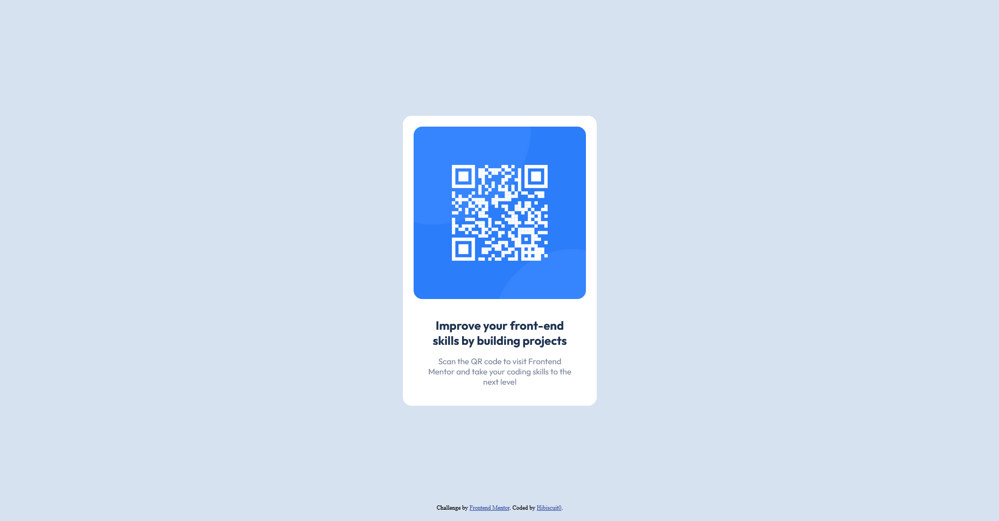

# Frontend Mentor - QR code component solution

This is a solution to the [QR code component challenge on Frontend Mentor](https://www.frontendmentor.io/challenges/qr-code-component-iux_sIO_H). Frontend Mentor challenges help you improve your coding skills by building realistic projects. 

## Table of contents

- [Overview](#overview)
  - [Screenshot](#screenshot)
  - [Links](#links)
- [My process](#my-process)
  - [Built with](#built-with)
  - [What I learned](#what-i-learned)
  - [Continued development](#continued-development)
  - [Useful resources](#useful-resources)
- [Author](#author)

**Note: Delete this note and update the table of contents based on what sections you keep.**

## Overview

### Screenshot

### Links

- Solution URL: https://github.com/Hibiscuit0/FrontEndMentor-QRCodeComponent
- Live Site URL: [https://front-end-mentor-qr-code-component.vercel.app/](https://front-end-mentor-qr-code-component-virid.vercel.app/)

## My process
- define the HTML structure & adding classes names
- adding css styles (font, color, bg-color, ...)
- adjusting the margin, padding, alignments to correspond to the given design

### Built with

- Semantic HTML5 markup
- CSS custom properties

### What I learned

How to vertical center a div...

### Continued development

But not sure yet that how I vertically centered the card is the better way without using flex or grid css properties.

### Useful resources

- [Alsa Creations] https://www.alsacreations.com/tuto/lire/1032-Comment-centrer-verticalement-sur-tous-les-navigateurs-.html - To find different ways for vertically centering the div in the browser

## Author

- Frontend Mentor - [@Hibiscuit0](https://www.frontendmentor.io/profile/Hibiscuit0)

